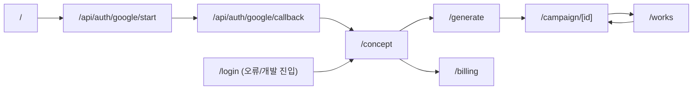
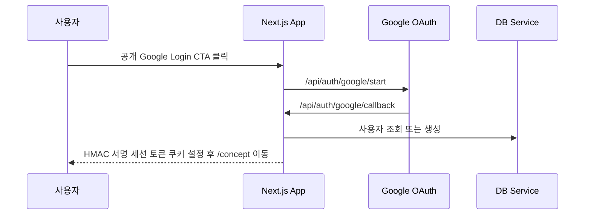
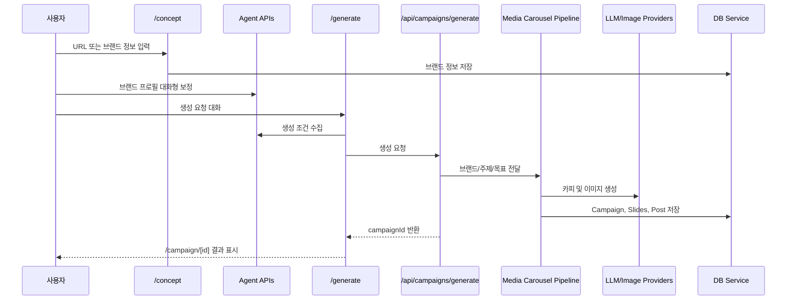
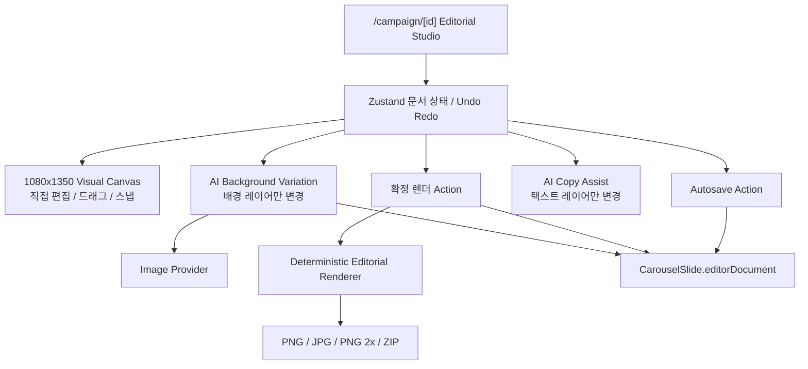
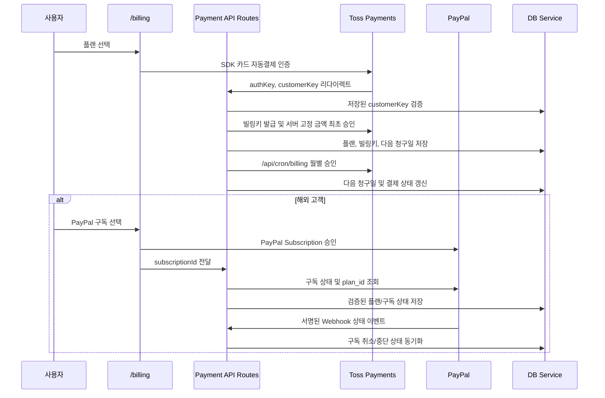
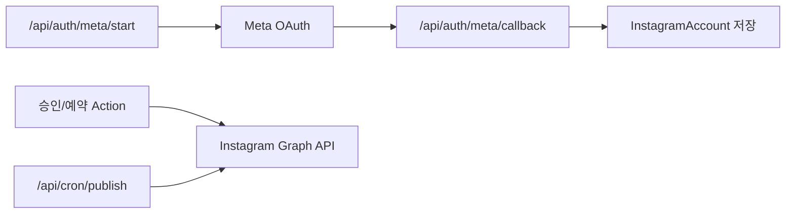

# Shuffla 현재 시스템 구조

기준일: 2026-05-26 (KST)
대상: `main` 이후 현재 작업 트리의 Next.js 애플리케이션

현재 구현 상태와 우선순위는 `CURRENT_STATUS_AND_IMPROVEMENTS.md`, 변경 경과는 `DEVELOPMENT_LOG.md`, 코드 책임 규칙은 `LAYERS.md`를 기준으로 한다.

## 1. 기술 구성

| 분류 | 구성 |
| --- | --- |
| Web Framework | Next.js 16 App Router, React 19, TypeScript |
| UI | Tailwind CSS 4, Framer Motion, Lucide React |
| DB | PostgreSQL, Prisma 5 |
| 파일 저장 | Vercel Blob 및 생성 이미지 저장 모듈 |
| AI/콘텐츠 | Gemini, Groq, OpenAI 계열 연동 모듈 및 레이아웃 파이프라인 |
| 결제 | 국내 Toss Payments 자동결제(빌링), 해외 PayPal Subscription |
| 소셜 게시 | Meta OAuth, Instagram Graph API |

## 2. 디렉터리 역할

| 경로 | 역할 |
| --- | --- |
| `app/` | App Router 페이지, Server Actions, API routes |
| `app/(cms)/` | 로그인 이후 CMS 사용자 화면 |
| `lib/` | 인증, DB 서비스, 결제, Meta/Instagram, 브랜드 분석 등 애플리케이션 서비스 |
| `src/lib/layout/` | 현재 카드뉴스 레이아웃/렌더링 중심 파이프라인 |
| `src/lib/carousel/` | 기존 또는 보조 카드뉴스 생성 엔진 모듈 |
| `src/lib/ai/` | LLM 및 이미지 공급자 추상화 |
| `app/api/agents/` | 브랜드 수정 및 카드뉴스 설정을 위한 대화형 API |
| `prisma/` | 데이터 모델과 로컬 데이터 관련 파일 |
| `scripts/` | 마이그레이션 스크립트 |

## 3. 사용자 화면 구조

CMS 내 실제 메뉴는 `Concept`, `Generate`, `Works` 중심으로 구성되어 있다. 결제 페이지는 존재하지만 Instagram 설정/연동 전용 페이지는 현재 CMS 라우트 목록에 존재하지 않는다.

## 4. 인증 및 사용자 세션 흐름

관련 모듈:

| 영역 | 파일 |
| --- | --- |
| Google OAuth 시작/콜백 | `app/api/auth/google/start/route.ts`, `app/api/auth/google/callback/route.ts` |
| 세션 쿠키 | `lib/auth/session.ts` |
| 로그인 사용자 조회 | `app/actions.ts`의 `getSessionUser()` |

세션은 `SESSION_SECRET` 기반 HMAC 서명 토큰으로 검증되며, 운영 환경에서는 32자 이상의 서명 키가 필요하다. 개발용 이메일 로그인은 운영 환경에서 차단된다.

## 5. 브랜드 분석 및 카드뉴스 생성 흐름

주요 파일:

| 단계 | 파일 |
| --- | --- |
| 브랜드 입력 UI | `app/(cms)/concept/ConceptForm.tsx` |
| 브랜드 분석 Action | `app/actions.ts`의 `analyzeBrandWebsiteAction()` |
| 브랜드 보정 Agent | `app/api/agents/brand/route.ts` |
| 생성 UI | `app/(cms)/generate/GenerateForm.tsx` |
| 생성 조건 Agent | `app/api/agents/generate/route.ts` |
| 생성 API 진입점 | `app/api/campaigns/generate/route.ts`, `src/app/api/campaigns/generate/route.ts` |
| 생성/렌더링 파이프라인 | `src/lib/layout/mediaCarouselPipeline.ts` |
| 결과 UI | `app/(cms)/campaign/[id]/CampaignResultView.tsx` |

`/generate`는 참고 이미지를 최대 4장 업로드해 생성 API에 `productImageUrls`로 전달한다. 이미지 공급자는 Vercel Blob 또는 애플리케이션 `/uploads/` 경로처럼 신뢰되는 업로드 URL만 다시 가져온다.

브랜드 URL 분석에는 `lib/brand-url-collector.ts`와 함께 Gemini, Groq, Perplexity, Naver Shopping 연동 모듈이 존재한다. URL 수집기는 사설 주소 및 redirect 목적지 차단과 응답 크기 제한을 적용한다. 대화형 Agent API는 OpenAI 설정이 없을 경우 제한된 fallback 응답만 반환한다.

## 6. 결과 편집 및 저장 구조

`editorDocument`는 배경, 오버레이, 타이틀, 본문, 스티커, CTA, 워터마크 레이어와 위치/순서/스타일/모션 메타데이터, 슬라이드 역할·의도, 오버레이 프리셋을 저장한다. 캔버스 조작은 로컬 상태에서 즉시 반응하고 저장/내보내기 때 서버가 검증된 문서를 결정론적으로 렌더한다. 확정 렌더 시 선택한 타이포그래피/오버레이 스타일은 `Brand.editorPreferences`에 저장되어 이후 새 슬라이드 편집의 시작값이 된다. 관련 Server Actions는 `app/actions.ts`, 문서/렌더 계약은 `src/lib/editor/*`에 위치한다.

## 7. 데이터 모델

핵심 저장 객체:

| 모델 | 용도 |
| --- | --- |
| `User` | 로그인 사용자, 플랜, 토스 빌링키/청구 상태 또는 PayPal 구독 상태 |
| `Brand` | 브랜드 분석 결과, 생성 기준 정보 및 에디터 스타일 선호 |
| `Campaign` | 카드뉴스 생성 단위와 상태, 사용 이미지 모델 및 AI 재생성 이미지 수 |
| `CarouselSlide` | 각 슬라이드 카피, 원본 배경, 확정 이미지 및 `editorDocument` 레이어 문서 |
| `Post` | Instagram 게시 캡션, 예약 시간, 게시 상태 |
| `InstagramAccount` | Meta 연동 계정 및 암호화 토큰 |

## 8. 결제 구조

관련 파일:

| 기능 | 파일 |
| --- | --- |
| 결제 UI | `app/(cms)/billing/PricingClientView.tsx` |
| 최초 승인/취소 | `app/api/payments/toss/*` |
| 월별 청구 | `app/api/cron/billing/route.ts` |
| 토스 API 클라이언트 | `lib/tosspayments.ts` |
| 해외 구독 활성화/취소/Webhook | `app/api/paypal/*` |
| PayPal API 클라이언트 | `lib/paypal.ts` |
| 요금제 제한 | `lib/limits.ts` |

국내 카드 경로에서 브라우저는 카드 등록 인증만 수행하며 결제 금액은 서버의 플랜 매핑으로 결정된다. `customerKey`는 사용자별 무작위 값으로 DB에 저장하고 콜백에서 일치 여부를 검증한다. 토스페이먼츠 자동결제는 별도 빌링 계약이 필요하고 자체 스케줄링을 제공하지 않으므로 보호된 크론 호출이 필요하다. 해외 PayPal 경로는 PayPal에서 조회한 `plan_id`와 서명된 웹훅만 신뢰한다. 한 사용자에게는 토스 또는 PayPal 중 하나의 활성 구독만 허용한다. `FREE`는 생성 권한 없는 내부 상태이며, 유료 상품은 Single(월 3,000원/1회), Creator(월 19,000원/20회), Studio(월 45,000원/30회)다.

AI 이미지 원가는 캠페인 단위로 통제한다. 활성 CMS OpenAI 이미지 모델은 `gpt-image-1`로 고정하며, `Campaign.imageModel`, `initialImageCount`, `regenerationImageCount`, `lastRegenerationImageModel`에 생성 사용량을 저장한다. 결과 화면의 AI 배경 재생성은 최초 슬라이드 수와 같은 이미지 크레딧까지만 서버에서 원자적으로 예약해 허용한다.

## 9. Instagram 게시 구조

백엔드 구현 위치:

| 기능 | 파일 |
| --- | --- |
| Meta OAuth | `app/api/auth/meta/*`, `lib/meta/*` |
| Instagram 게시 클라이언트 | `lib/instagram/client.ts` |
| 예약 게시 실행 | `app/api/cron/publish/route.ts` |
| 승인/예약 Action | `app/actions.ts` |

현재 OAuth 완료/오류 리다이렉트가 `/instagram`을 대상으로 하지만 해당 UI 경로가 현재 CMS에 없으므로 사용자 기능으로는 완료되지 않은 상태다.

## 10. 운영 경계와 검증 지점

| 경계 | 확인할 사항 |
| --- | --- |
| 인증 | HMAC 서명 세션 적용됨; OAuth state와 키 운영 검증 지속 |
| 외부 URL 수집 | SSRF/redirect/크기 방어 적용됨; 운영 관측 지속 |
| AI 생성 | 주요 배열 응답 fallback 및 이미지 재생성 상한/수량 기록 적용됨; 실제 청구 토큰·생성 시간 관측 보완 |
| 업로드 | MIME/파일 크기/요청당 4장 적용됨; 사용자 쿼터와 속도 제한 보완 |
| 결제 | 국내 토스 빌링 및 해외 PayPal 구독 검증 구현됨; 각 공급자 계약/키, 운영 크론 및 sandbox E2E 필요 |
| 게시 | Instagram 연결 UI, 예약 게시 재시도 및 실패 알림 |
| 데이터 저장 | 운영 DB fail-closed, 마이그레이션 및 백업 |

현재 구현의 우선순위와 장애 목록은 `CURRENT_STATUS_AND_IMPROVEMENTS.md`를 기준 문서로 사용한다.
