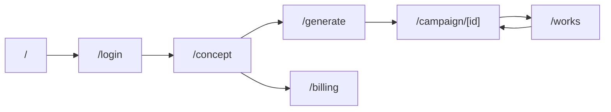
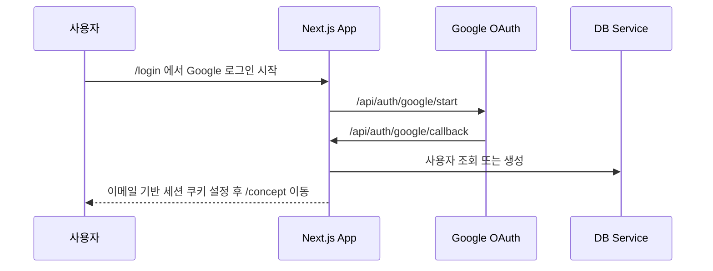
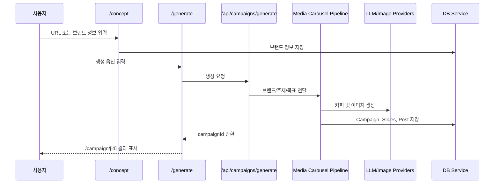
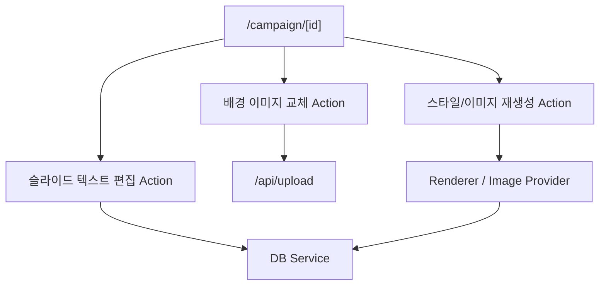
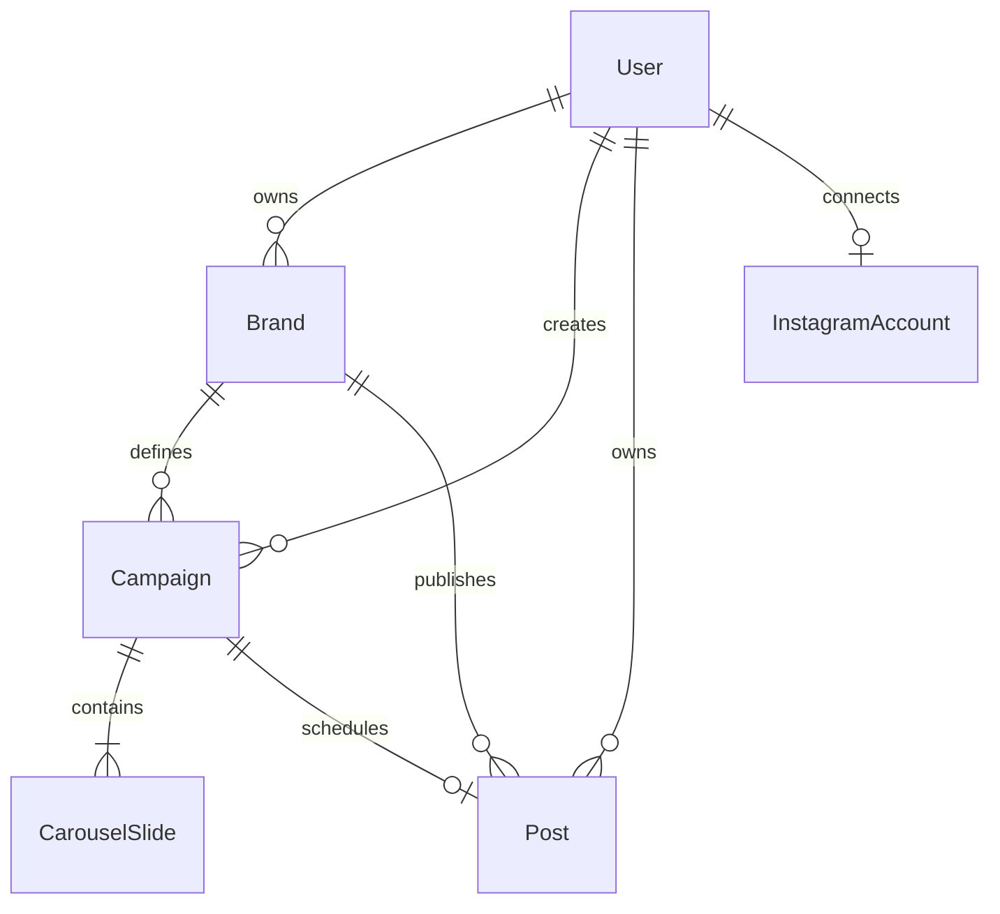
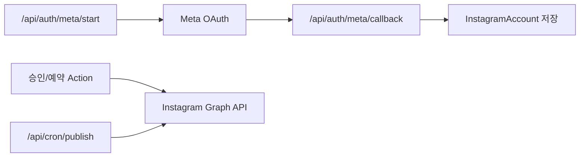

# Shuffla 현재 시스템 구조

기준일: 2026-05-25 (KST)
대상: 현재 `main` 작업 트리 기준 Next.js 애플리케이션

## 1. 기술 구성

| 분류 | 구성 |
| --- | --- |
| Web Framework | Next.js 16 App Router, React 19, TypeScript |
| UI | Tailwind CSS 4, Framer Motion, Lucide React |
| DB | PostgreSQL, Prisma 5 |
| 파일 저장 | Vercel Blob 및 생성 이미지 저장 모듈 |
| AI/콘텐츠 | Gemini, Groq, OpenAI 계열 연동 모듈 및 레이아웃 파이프라인 |
| 결제 | PayPal Subscription API/Webhook |
| 소셜 게시 | Meta OAuth, Instagram Graph API |

## 2. 디렉터리 역할

| 경로 | 역할 |
| --- | --- |
| `app/` | App Router 페이지, Server Actions, API routes |
| `app/(cms)/` | 로그인 이후 CMS 사용자 화면 |
| `lib/` | 인증, DB 서비스, 결제, Meta/Instagram, 브랜드 분석 등 애플리케이션 서비스 |
| `src/lib/layout/` | 현재 카드뉴스 레이아웃/렌더링 중심 파이프라인 |
| `src/lib/carousel/` | 기존 또는 보조 카드뉴스 생성 엔진 모듈 |
| `src/lib/ai/` | LLM 및 이미지 공급자 추상화 |
| `prisma/` | 데이터 모델과 로컬 데이터 관련 파일 |
| `scripts/` | 마이그레이션 및 PayPal 설정 스크립트 |

## 3. 사용자 화면 구조

CMS 내 실제 메뉴는 `Concept`, `Generate`, `Works` 중심으로 구성되어 있다. 결제 페이지는 존재하지만 Instagram 설정/연동 전용 페이지는 현재 CMS 라우트 목록에 존재하지 않는다.

## 4. 인증 및 사용자 세션 흐름

관련 모듈:

| 영역 | 파일 |
| --- | --- |
| Google OAuth 시작/콜백 | `app/api/auth/google/start/route.ts`, `app/api/auth/google/callback/route.ts` |
| 세션 쿠키 | `lib/auth/session.ts` |
| 로그인 사용자 조회 | `app/actions.ts`의 `getSessionUser()` |

현재 세션은 이메일 쿠키 값을 사용자 식별자로 사용하므로, 운영 보안 요구사항을 충족하려면 서명 또는 서버 세션 저장 방식으로 변경해야 한다.

## 5. 브랜드 분석 및 카드뉴스 생성 흐름

주요 파일:

| 단계 | 파일 |
| --- | --- |
| 브랜드 입력 UI | `app/(cms)/concept/ConceptForm.tsx` |
| 브랜드 분석 Action | `app/actions.ts`의 `analyzeBrandWebsiteAction()` |
| 생성 UI | `app/(cms)/generate/GenerateForm.tsx` |
| 생성 API 진입점 | `app/api/campaigns/generate/route.ts`, `src/app/api/campaigns/generate/route.ts` |
| 생성/렌더링 파이프라인 | `src/lib/layout/mediaCarouselPipeline.ts` |
| 결과 UI | `app/(cms)/campaign/[id]/CampaignResultView.tsx` |

참고 이미지 URL 입력은 생성 API에 정의되어 있으나, 현재 `/generate` UI에서 업로드 및 전달되는 흐름은 연결되어 있지 않다.

## 6. 결과 편집 및 저장 구조

관련 Server Actions는 `app/actions.ts`에 위치한다. 현재 배경 이미지 교체 UI와 업로드 API의 요청/응답 필드가 일치하지 않아 해당 경로는 수정이 필요하다.

## 7. 데이터 모델

핵심 저장 객체:

| 모델 | 용도 |
| --- | --- |
| `User` | 로그인 사용자, 플랜, PayPal 구독 상태 |
| `Brand` | 브랜드 분석 결과 및 생성 기준 정보 |
| `Campaign` | 카드뉴스 생성 단위와 상태 |
| `CarouselSlide` | 각 슬라이드 카피 및 이미지 |
| `Post` | Instagram 게시 캡션, 예약 시간, 게시 상태 |
| `InstagramAccount` | Meta 연동 계정 및 암호화 토큰 |

## 8. 결제 구조

```mermaid
sequenceDiagram
    participant U as 사용자
    participant UI as /billing
    participant API as PayPal API Route
    participant PP as PayPal
    participant DB as DB Service

    U->>UI: 플랜 선택
    UI->>PP: 구독 승인
    UI->>API: subscriptionId, 선택 플랜 전달
    API->>PP: 구독 상태 조회
    API->>DB: 사용자 플랜/구독 상태 저장
    PP->>API: Webhook 이벤트
    API->>DB: 결제 상태 동기화
```

관련 파일:

| 기능 | 파일 |
| --- | --- |
| 결제 UI | `app/(cms)/billing/PricingClientView.tsx` |
| 활성화/취소/Webhook | `app/api/paypal/*` |
| PayPal 클라이언트 | `lib/paypal.ts` |
| 요금제 제한 | `lib/limits.ts` |

구독 활성화 시 내부 플랜 결정은 클라이언트 전달값이 아니라 PayPal 구독의 검증된 `plan_id`를 기준으로 해야 한다.

## 9. Instagram 게시 구조

백엔드 구현 위치:

| 기능 | 파일 |
| --- | --- |
| Meta OAuth | `app/api/auth/meta/*`, `lib/meta/*` |
| Instagram 게시 클라이언트 | `lib/instagram/client.ts` |
| 예약 게시 실행 | `app/api/cron/publish/route.ts` |
| 승인/예약 Action | `app/actions.ts` |

현재 OAuth 완료/오류 리다이렉트가 `/instagram`을 대상으로 하지만 해당 UI 경로가 현재 CMS에 없으므로 사용자 기능으로는 완료되지 않은 상태다.

## 10. 운영 경계와 검증 지점

| 경계 | 확인할 사항 |
| --- | --- |
| 인증 | 세션 위조 방지, OAuth state 검증, 로그아웃 무효화 |
| 외부 URL 수집 | SSRF 차단, timeout, 콘텐츠 크기 제한 |
| AI 생성 | 응답 스키마 검증, 실패 fallback, 생성 시간 및 비용 |
| 업로드 | MIME 검증, 수량/크기/쿼터 제한, 접근 정책 |
| 결제 | PayPal 플랜 검증, webhook 멱등성, 취소 시점 정책 |
| 게시 | Instagram 연결 UI, 예약 게시 재시도 및 실패 알림 |
| 데이터 저장 | 운영 DB fail-closed, 마이그레이션 및 백업 |

현재 구현의 우선순위와 장애 목록은 `CURRENT_STATUS_AND_IMPROVEMENTS.md`를 기준 문서로 사용한다.
