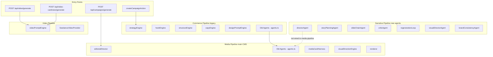

# Architecture Review & Improvement Plan

> **Date:** 2026-06-22  
> **Scope:** Full codebase architecture review of `snsagent` (Shuffla)  
> **Baseline:** [`LAYERS.md`](LAYERS.md:1) (official layer definition) vs actual implementation

---

## Executive Summary

The Shuffla codebase has grown significantly beyond its documented architecture. [`LAYERS.md`](LAYERS.md:1) defines an 11-layer system (L1–L11) but does not reflect major subsystems added since its last update: a multi-agent narrative pipeline, a copywriting knowledge base, an editorial director, an intelligence/trend layer, Inngest background jobs, a video pipeline, Polar payments, an MCP API, an admin panel, and i18n locale routing. The core layering principle (top-down calls only) is sound, but several structural issues now threaten maintainability.

**Top 5 concerns:**
1. **Documentation drift** — LAYERS.md is missing ~40% of the actual codebase
2. **Dual agent systems** — Two parallel agent architectures coexist without clear boundaries
3. **Monolithic `app/actions.ts`** — 1,989 lines mixing L2/L6/L8 concerns
4. **Payment provider sprawl** — Four providers (Toss, PayPal, Nicepay, Polar) with overlapping fields
5. **Routing duplication** — `app/(cms)/` and `app/[locale]/(cms)/` coexist (incomplete i18n migration)

---

## 1. Current State Analysis

### 1.1 What LAYERS.md Documents vs What Exists

| Subsystem | In LAYERS.md? | Actual Location | Notes |
|-----------|:---:|----------------|-------|
| Commerce pipeline | ✅ | [`src/lib/carousel/pipeline.ts`](src/lib/carousel/pipeline.ts:1) | Legacy, not main CMS flow |
| Media pipeline | ✅ | [`src/lib/layout/mediaCarouselPipeline.ts`](src/lib/layout/mediaCarouselPipeline.ts:1) | Main CMS flow, 1,567 lines |
| Narrative pipeline | ❌ | [`src/lib/carousel/narrativePipeline.ts`](src/lib/carousel/narrativePipeline.ts:1) | New multi-agent system |
| New agent system | ❌ | [`src/lib/carousel/agents/`](src/lib/carousel/agents/directorAgent.ts:1) | 7 agent files |
| Copywriting knowledge base | ❌ | [`src/lib/copywriting/`](src/lib/copywriting/copyKnowledgeBase.ts:1) | 9 files, 1,072+ lines |
| Editorial director | ❌ | [`src/lib/editorial/editorialDirector.ts`](src/lib/editorial/editorialDirector.ts:1) | 861 lines |
| Intelligence layer | ❌ | [`src/lib/intelligence/`](src/lib/intelligence/brandIntelligence.ts:1) | Brand intelligence, edit logger |
| Inngest background jobs | ❌ | [`src/lib/inngest/`](src/lib/inngest/client.ts:1) | 4 functions, unclear wiring |
| Video pipeline | ❌ | [`src/lib/video/videoCardPipeline.ts`](src/lib/video/videoCardPipeline.ts:1) | Seedance-based, 9:16 |
| Polar payments | ❌ | [`app/api/polar/`](app/api/polar/checkout/route.ts:1) | 4th payment provider |
| MCP API | ❌ | [`app/api/mcp/`](app/api/mcp/key/route.ts:1) | API key management |
| Admin panel | ❌ | [`app/admin/`](app/admin/page.tsx:1) | Users, payments, templates |
| i18n locale routing | ❌ | [`app/[locale]/`](app/[locale]/layout.tsx:1) | Parallel route structure |
| RSS / Sitemap / Robots | ❌ | [`app/api/rss/`](app/api/rss/route.ts:1) | SEO infrastructure |
| Templates system | ❌ | [`lib/templates/`](lib/templates/select.ts:1) | Card template selection |
| New DB models (10+) | ❌ | [`prisma/schema.prisma`](prisma/schema.prisma:297:1) | Intelligence + admin models |

### 1.2 Pipeline Architecture — Current State

The codebase now has **four** generation pipelines with unclear relationships:



**Key issue:** The narrative pipeline ([`narrativePipeline.ts`](src/lib/carousel/narrativePipeline.ts:20)) implements a sophisticated multi-agent system (Director → StoryPlanning → SlideChain → BrandConsistency → Critic → RegenerationLoop → VisualDirector), but the media pipeline ([`mediaCarouselPipeline.ts`](src/lib/layout/mediaCarouselPipeline.ts:1)) still uses the older rule-based agents from [`agents.ts`](src/lib/carousel/agents.ts:1). It is unclear whether the narrative pipeline is meant to replace or supplement the media pipeline's agent chain.

### 1.3 Layer Violations (Confirmed)

| Location | Violation | Severity |
|----------|-----------|----------|
| [`app/actions.ts:7`](app/actions.ts:7) | L2 directly imports `OpenAI` SDK | 🔴 High |
| [`app/actions.ts:10-20`](app/actions.ts:10) | L2 imports L6/L8 modules (renderers, typography, editors) | 🔴 High |
| [`app/actions.ts`](app/actions.ts:1) | 1,989-line file mixing L2 + L6 + L8 logic | 🔴 High |
| [`app/api/agents/brand/route.ts`](app/api/agents/brand/route.ts:1) | L2 route directly calls OpenAI | 🟡 Medium |
| [`app/api/agents/generate/route.ts`](app/api/agents/generate/route.ts:1) | L2 route directly calls OpenAI | 🟡 Medium |
| [`lib/ai/generateCarousel.ts`](lib/ai/generateCarousel.ts:1) | Legacy L7 file, not integrated into `src/lib/ai/` | 🟢 Low |
| [`lib/ai/imageProvider.ts`](lib/ai/imageProvider.ts:1) | Legacy L7 file, duplicates `src/lib/ai/imageProvider.ts` | 🟢 Low |
| [`src/lib/typography/typographyEngine.ts`](src/lib/typography/typographyEngine.ts:1) | Duplicate of `src/lib/layout/typographyEngine.ts` | 🟢 Low |
| [`prisma/db.json`](prisma/db.json:1) | JSON file DB remnant | 🟢 Low |

### 1.4 Payment Provider Sprawl

The [`User` model](prisma/schema.prisma:12) now carries fields for **four** payment providers:

| Provider | Schema Fields | API Routes | Status |
|----------|--------------|-------------|--------|
| Toss Payments | `tossCustomerKey`, `tossBillingKey`, `tossPaymentKey`, `tossLastOrderId`, `tossSubscriptionStatus`, `tossNextBillingAt`, `tossLastPaidAt`, `tossCanceledAt` | `app/api/payments/toss/*` | Active (KR) |
| PayPal | `paypalSubscriptionId`, `paypalSubscriptionStatus` | `app/api/paypal/*` | Active (Intl) |
| Nicepay | `nicepayBid`, `nicepaySubscriptionStatus`, `nicepayNextBillingAt`, `nicepayLastPaidAt`, `nicepayCanceledAt`, `nicepayLastOrderId` | Not found in routes | ⚠️ Orphaned? |
| Polar | `polarSubscriptionId`, `polarSubscriptionStatus` | `app/api/polar/*` | Active (new) |

**Concern:** Nicepay fields exist in schema but no corresponding API routes were found. Polar appears to be the newest addition. The relationship between Polar and the existing Toss/PayPal providers is unclear — is Polar replacing them, or coexisting?

### 1.5 Routing Duplication (i18n Migration)

Two parallel route structures exist:

```
app/(cms)/concept/page.tsx          ← Original
app/[locale]/(cms)/concept/page.tsx  ← i18n version
```

This suggests an in-progress migration to [`next-intl`](package.json:27) with locale-based routing. The coexistence of both structures risks:
- Duplicate page rendering
- SEO canonical URL conflicts
- Maintenance burden (changes must be applied twice)

### 1.6 Monolithic Files

| File | Lines | Concern |
|------|-------|---------|
| [`app/actions.ts`](app/actions.ts:1) | 1,989 | L2 + L6 + L8 mixed |
| [`src/lib/layout/mediaCarouselPipeline.ts`](src/lib/layout/mediaCarouselPipeline.ts:1) | 1,567 | L4 orchestration + L6 generation + L8 rendering hints |
| [`src/lib/copywriting/copyKnowledgeBase.ts`](src/lib/copywriting/copyKnowledgeBase.ts:1) | 1,072 | L6 — types + data + logic in one file |
| [`src/lib/editorial/editorialDirector.ts`](src/lib/editorial/editorialDirector.ts:1) | 861 | L6 — analysis + planning + visual direction |

### 1.7 Security Observations

| Item | Risk | Notes |
|------|------|-------|
| [`app/api/auth/test-login/route.ts`](app/api/auth/test-login/route.ts:1) | 🔴 High | Test login endpoint — must be disabled in production |
| Upload quota | 🟡 Medium | No per-user storage quota (noted in README) |
| Rate limiting | 🟡 Medium | [`lib/rateLimiter.ts`](lib/rateLimiter.ts:1) exists but unclear if applied to all API routes |
| `test@test.com` bypass | 🟡 Medium | [`app/actions.ts:92`](app/actions.ts:92) — hardcoded email bypasses AI regeneration access check |

---

## 2. Improvement Plan

### Phase 1: Documentation Alignment (Low Risk)

**Goal:** Bring LAYERS.md in sync with reality. No code changes.

- [ ] **1.1** Update LAYERS.md layer map to include all new subsystems
- [ ] **1.2** Document the four-pipeline architecture and their intended relationships
- [ ] **1.3** Add L12 (Intelligence) and L13 (Background Jobs) layers, or fold into existing layers
- [ ] **1.4** Document the payment provider strategy (which providers are active, which are deprecated)
- [ ] **1.5** Document the i18n routing migration plan
- [ ] **1.6** Update the layer violation table with current status

### Phase 2: Split `app/actions.ts` (Medium Risk)

**Goal:** Decompose the 1,989-line monolith into domain-scoped action files.

- [ ] **2.1** Extract brand analysis LLM calls → `lib/ai/brandAnalyzer.ts` (L6)
- [ ] **2.2** Extract campaign recommendation LLM calls → `lib/ai/campaignRecommender.ts` (L6)
- [ ] **2.3** Extract AI regeneration logic → `lib/ai/slideRegenerator.ts` (L6)
- [ ] **2.4** Split `app/actions.ts` by domain:
  - `app/actions/auth.ts` (login, register, logout)
  - `app/actions/brand.ts` (saveBrand, analyzeBrand)
  - `app/actions/campaign.ts` (createCampaign, generate)
  - `app/actions/slide.ts` (updateSlide, rerender, AI regeneration)
  - `app/actions/billing.ts` (plan changes, payment callbacks)
- [ ] **2.5** Move all `new OpenAI()` calls out of L2 into L6/L7
- [ ] **2.6** Remove `test@test.com` hardcoded bypass — use proper feature flags

### Phase 3: Pipeline Consolidation — Narrative Replaces Old Agents (High Risk, High Impact)

**Goal:** Wire the narrative pipeline into the media pipeline as the copy generation step. Remove the old rule-based agents.

- [ ] **3.1** Refactor [`mediaCarouselPipeline.ts`](src/lib/layout/mediaCarouselPipeline.ts:1) to call [`runNarrativePipeline()`](src/lib/carousel/narrativePipeline.ts:20) instead of the old `BrandIdentityAgent` / `CopywritingAgent` / `VisualConceptAgent` / `QualityGuardAgent` chain
- [ ] **3.2** Map narrative pipeline outputs (`SlideCopy[]`, `SlideDesignPrompt[]`) into the media pipeline's slide rendering flow
- [ ] **3.3** Ensure `runNarrativePipeline` receives the `EditorialBriefing` and `CopyKnowledgeContext` that the media pipeline currently builds
- [ ] **3.4** Remove old agent classes from [`src/lib/carousel/agents.ts`](src/lib/carousel/agents.ts:1) (`BrandIdentityAgent`, `CopywritingAgent`, `VisualConceptAgent`, `QualityGuardAgent`) after confirming no other callers
- [ ] **3.5** Extract the 1,567-line `mediaCarouselPipeline` into sub-modules:
  - `mediaCarouselPipeline.ts` — orchestration only (L4)
  - `mediaSlidePlanner.ts` — slide structure planning (L6)
  - `mediaCardComposer.ts` — harness + typography + render coordination (L8)
- [ ] **3.6** Unify the video pipeline to share copy generation with the media pipeline (both use narrative pipeline output)
- [ ] **3.7** Update LAYERS.md L5 section to document the new agent architecture as the sole agent system

### Phase 4: Payment Provider Consolidation → Polar Only (Medium Risk)

**Goal:** Consolidate to Polar as the sole payment provider. Remove Toss, PayPal, and Nicepay.

- [ ] **4.1** Audit all Toss/PayPal/Nicepay references across codebase (routes, actions, lib, components)
- [ ] **4.2** Create Prisma migration to remove provider-specific fields from `User` model:
  - Remove: `tossCustomerKey`, `tossBillingKey`, `tossPaymentKey`, `tossLastOrderId`, `tossSubscriptionStatus`, `tossNextBillingAt`, `tossLastPaidAt`, `tossCanceledAt`
  - Remove: `paypalSubscriptionId`, `paypalSubscriptionStatus`
  - Remove: `nicepayBid`, `nicepaySubscriptionStatus`, `nicepayNextBillingAt`, `nicepayLastPaidAt`, `nicepayCanceledAt`, `nicepayLastOrderId`
  - Keep: `polarSubscriptionId`, `polarSubscriptionStatus`
- [ ] **4.3** Delete API routes: `app/api/payments/toss/*`, `app/api/paypal/*`
- [ ] **4.4** Remove Toss/PayPal client SDKs and components (`@paypal/react-paypal-js`, Toss SDK)
- [ ] **4.5** Update [`app/(cms)/billing/`](app/(cms)/billing/PricingClientView.tsx:1) to use Polar checkout only
- [ ] **4.6** Update [`app/api/cron/billing/route.ts`](app/api/cron/billing/route.ts:1) — remove Toss billing cron, keep only Polar webhook-based billing
- [ ] **4.7** Remove migration scripts: [`scripts/migrate-tosspayments.mjs`](scripts/migrate-tosspayments.mjs:1), [`scripts/migrate-paypal.mjs`](scripts/migrate-paypal.mjs:1)
- [ ] **4.8** Update `PaymentRecord` provider field to default to `'polar'`
- [ ] **4.9** Update README, LAYERS.md, and `.env.example` to remove Toss/PayPal/Nicepay variables
- [ ] **4.10** Data migration: Map existing active Toss/PayPal subscriptions to Polar (or handle grandfathered users)

### Phase 5: i18n Routing Migration (Medium Risk)

**Goal:** Complete the locale-based routing migration.

- [ ] **5.1** Audit which routes exist in both `app/(cms)/` and `app/[locale]/(cms)/`
- [ ] **5.2** Identify routes that only exist in one structure (incomplete migration)
- [ ] **5.3** Consolidate to a single routing approach (recommend `app/[locale]/` with middleware)
- [ ] **5.4** Remove duplicate route files after migration
- [ ] **5.5** Ensure [`i18n/routing.ts`](i18n/routing.ts:1) covers all locales

### Phase 6: Legacy Code Cleanup (Low Risk)

**Goal:** Remove dead code and duplicates.

- [ ] **6.1** Remove [`lib/ai/generateCarousel.ts`](lib/ai/generateCarousel.ts:1) (legacy, confirmed unused)
- [ ] **6.2** Consolidate [`lib/ai/imageProvider.ts`](lib/ai/imageProvider.ts:1) into `src/lib/ai/imageProvider.ts`
- [ ] **6.3** Consolidate [`src/lib/typography/typographyEngine.ts`](src/lib/typography/typographyEngine.ts:1) into `src/lib/layout/typographyEngine.ts`
- [ ] **6.4** Remove [`prisma/db.json`](prisma/db.json:1) (JSON DB remnant)
- [ ] **6.5** Audit and remove any unused Inngest functions if not wired
- [ ] **6.6** Remove or gate [`app/api/auth/test-login/route.ts`](app/api/auth/test-login/route.ts:1) behind `NODE_ENV !== 'production'`

### Phase 7: Intelligence Layer Wiring (Medium Risk)

**Goal:** Clarify and connect the intelligence/trend subsystem.

- [ ] **7.1** Document how Inngest functions ([`analyzeContent`](src/lib/inngest/functions/analyzeContent.ts:1), [`crawlTrends`](src/lib/inngest/functions/crawlTrends.ts:1), etc.) connect to the main pipeline
- [ ] **7.2** Wire `SummarizedPreference` and `UserEditLog` data into the generation pipeline as personalization context
- [ ] **7.3** Connect `CrawledPost` / `TrendSignal` / `ViralCopyPattern` to the copywriting knowledge base
- [ ] **7.4** Ensure Inngest dev server / cloud is configured for production

### Phase 8: Security Hardening (Medium Risk)

**Goal:** Close security gaps before production.

- [ ] **8.1** Disable or gate test-login route in production
- [ ] **8.2** Implement per-user upload storage quota
- [ ] **8.3** Apply rate limiting to all API routes (not just some)
- [ ] **8.4** Remove hardcoded `test@test.com` bypass
- [ ] **8.5** Audit all `process.env` direct access (should go through `lib/env.ts`)
- [ ] **8.6** Ensure DB fail-closed mode for production

---

## 3. Recommended Priority

| Priority | Phase | Rationale |
|:--------:|-------|-----------|
| P0 | Phase 8 (Security) | Must close before any production deployment |
| P0 | Phase 2 (Split actions.ts) | Largest source of layer violations; blocks clean refactoring |
| P1 | Phase 3 (Pipeline consolidation) | Confirmed decision — narrative replaces old agents; highest architectural impact |
| P1 | Phase 4 (Payments → Polar only) | Confirmed decision — consolidate to Polar; removes 3 providers' worth of complexity |
| P2 | Phase 1 (Documentation) | No code risk; aligns team understanding after Phases 2–4 settle |
| P2 | Phase 5 (i18n) | Completes migration; medium risk |
| P3 | Phase 6 (Legacy cleanup) | Low risk, improves navigability |
| P3 | Phase 7 (Intelligence) | Feature enhancement, not blocking |

---

## 4. Confirmed Architectural Decisions

| # | Decision | Confirmed By |
|---|----------|-------------|
| 1 | **Narrative pipeline fully replaces old agents** — The new multi-agent system (`directorAgent` → `slideChainAgent` → `criticAgent` → `regenerationLoop` → `visualDirectorAgent` → `brandConsistencyAgent`) will replace the old rule-based agents in [`agents.ts`](src/lib/carousel/agents.ts:1) within the media pipeline | User |
| 2 | **Polar replaces Toss + PayPal** — Consolidate to Polar as the sole payment provider. Remove Toss, PayPal, and Nicepay fields, routes, and logic | User |

### Remaining Open Questions

3. **i18n routing:** Should the non-locale routes (`app/(cms)/`) be removed in favor of `app/[locale]/(cms)/`?
4. **Inngest:** Are the background job functions actively used, or are they scaffolding for future work?
5. **Video pipeline:** Is the video card news feature production-bound or experimental?
